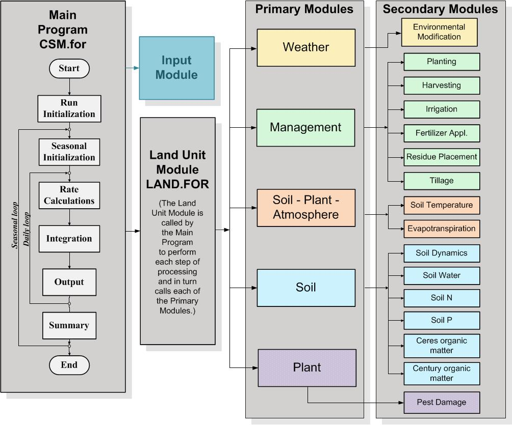

# Motivación

Los eventos de sequía constituyen el factor más importante asociado a la disminución del rendimiento de los cultivos del sector agrícola. A su vez, esta disminución en el rendimiento de los cultivos, se traduce en millonarias pérdidas para el sector y la economía en general. Es por ello que resulta de interés el estudio de este fenómeno con el objetivo de definir políticas de mitigación. 

Para poder llevar a cabo acciones de mitigación, se requiere una comprensión de los vínculos entre las características de los eventos de sequía (por ejemplo, momento de ocurrencia, duración, intensidad, etc.) y sus impactos específicos sobre el rendimiento de los cultivos. El propósito de este trabajo será generar información cuantitativa que vincule condiciones de sequía con rendimientos obtenidos para cultivos comercialmente importantes. 

Generar tal información será fundamental para diseñar un sistema de alerta temprana para el sector agrícola. Para emitir una alerta temprana es necesario, además, cuantificar o estimar los posibles impactos con cierto tiempo de antelación para poder realizar acciones de mitigación de dichos impactos. Para evaluar los impactos, se buscará vincular diferentes tipos de eventos secos (cortos pero intensos, largos pero poco intensos, etc.) que ocurran en los distintos momentos del ciclo del cultivo para distintas regiones del sur de sudamérica con los rendimientos resultantes. 

Un enfoque tradicional para abordar este estudio sería mediante la vinculación de variables meteorológicas históricas que definan condiciones de sequía y los resultados reales obtenidos. Sin embargo, abarcar todas las posibles combinaciones de tipos de eventos, momentos del cultivo y regiones geográficas (las cuales as su vez incluyen distintos tipos de suelo y de manejos de los cultivos) resulta una tarea imposible de ser realizada con series históricas, dado que no incluyen la diversidad condiciones que se quieren estudiar. 

La alternativa propuesta se basa en la utilización del modelo de simulación DSSAT (https://dssat.net). Este modelo representa el crecimiento y rendimiento del cultivo, y además provee información sobre condiciones intermedias (ej. porcentaje de agua útil, estrés del cultivo, etc.). El uso de DSSAT además permite ignorar efectos de confusión que pueden agregar variación al rendimiento (enfermedades, plagas, innovaciones tecnológicas, condiciones económicas) causadas por factores no relacionados directamente con la sequía. 

DSSAT es una herramienta de software que está compuesta por un conjunto de módulos, cada uno de los cuales tiene el propósito de modelar un determinado fenómeno (ver Fig. 1). A su vez, cada módulo está compuesto por varios submódulos que representan procesos biológicos relativamente simples. Estos procesos están descriptos por modelos basados en ecuaciones diferenciales en derivadas parciales.

Un primer enfoque para vincular condiciones de sequía (datos de entrada) con rendimientos resultantes (datos de salida), sería mediante el estudio de las ecuaciones diferenciales que gobiernan cada uno de los procesos que componen el DSSAT. Sin embargo, esta tarea sería operacionalmente imposible debido a la dimensionalidad de los datos de entrada y la complejidad del modelo integrado resultante (que a su vez, contiene un considerable número de parámetros asociados a manejos del cultivo, tipo de suelos, etc.).

El problema de la dimensionalidad radica en el gran número de variables de entrada, dado que es necesario definir valores de temperatura y precipitación para cada uno de los días del ciclo de vida del cultivo. Cada uno de estos valores representa un dato de entrada, por lo que el modelo resultante puede considerarse una composición de funciones dependientes de algunos cientos de variables. A su vez, esta composición de procesos (que son más de una decena, tal como se muestra en la Fig. 1) implica que el modelo, visto como un todo, resulta ser un sistema muy complejo como para ser estudiado por métodos analíticos tradicionales.

Por lo expuesto previamente, resulta más adecuado aplicar el método de Montecarlo para abordar el estudio de los efectos de la sequía en los rendimientos de los cultivos. Este método es utilizado para aproximar expresiones matemáticas complejas y costosas de evaluar con exactitud. Para ello se requiere la generación aleatoria de numerosos conjuntos de datos de entrada, los cuales puedan ser vinculados a datos de salida mediante procesos de simulación llevados a cabo mediante el uso de DSSAT.

Luego de obtener los resultados de las simulaciones, es necesario realizar tareas de análisis para vincular los datos de entrada con los rendimientos obtenidos. Considerando la dimensionalidad de los datos de entrada y la cantidad de condiciones que se quieren simular, resulta adecuado aplicar técnicas de análisis basadas en procesos de aprendizaje automático. Estas técnicas permitirán encontrar patrones que vinculen las condiciones de sequía con los rendimientos obtenidos.