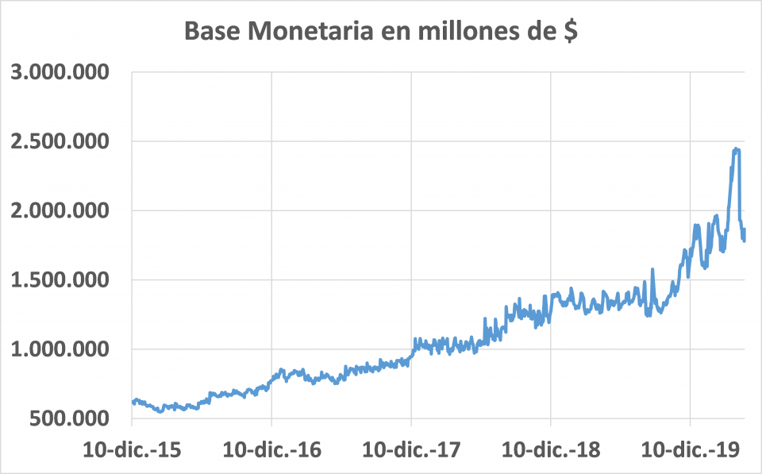
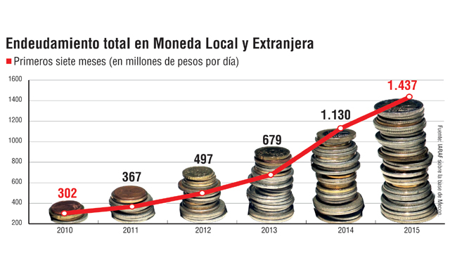
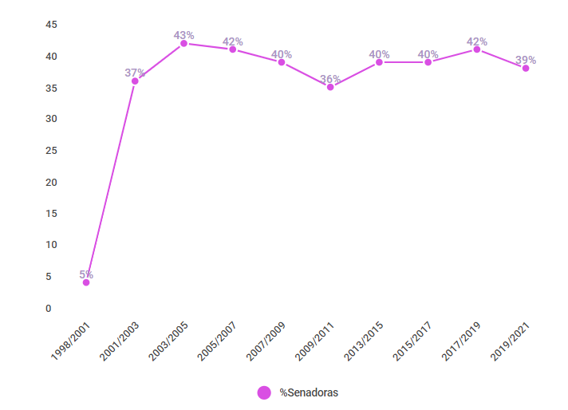

# 1. Análisis de gráficos de medios locales.

En este primer inciso del trabajo práctico se solicita buscar ejemplos de gráficos publicados en medios locales que no respeten los principios que propone Edward Tufte en *The visual display of quantitative information*. A continuación, se presentarán tres ejemplos los cuales serán analizados bajo los criterios propuestos por Tufte.

En la Fig. 1 observamos un gráfico publicado en el medio *Página 12* ([https://www.pagina12.com.ar/266119-por-que-el-aumento-de-la-emision-monetaria-redujo-la-inflaci]), el cual muestra la evolución de la base monetaria de Argentina entre el 10 de diciembre de 2015 y el 10 de diciembre de 2019. Este gráfico expresa los valores de base monetaria en unidades nominales. A priori, se podría argumentar que esto viola uno de los principios de Tufte el cual indica que *en las series de tiempo monetarias, casi siempre es mejor usar unidades estandariazadas en lugar de nominales*. Sin embargo, dado que el artículo intenta correlacionar la emisión monetaria con la inflación, resultaría aceptable utilizar unidades nominales, aunque de todos modos los valores de inflación no aparecen en ningún lado, motivo por el cual el gráfico carece de dicha información.



Pero el mayor problema que tiene el gráfico de la Fig. 1 es la escala del eje Y. Puede observarse que los valores de base monetaria se representan como distancia entre los puntos azules y el origen del eje Y. Sin embargo, el eje Y comienza con el valor 500.000, motivo por el cual las distancias comparativas entre valores del eje no guardan relación con los datos. Aplicando la metodología de Tufte, se comparará las distancias que representan los valores Y1 = 1.000.000 e Y2 = 3.000.000. Si analizamos los datos, la variación porcentual entre ambos puntos (considerando el mayor respecto del menor) es:

$$ PropDatos = 100\frac{Y2-Y1}{Y1}\% = 100\frac{3.000.000 - 1.000.000}{1.000.000}\% = 200\%$$

Realizando el mismo cálculo utilizando las distancias del gráfico, medida en *ticks* del eje Y, el resultado es el siguiente:

$$ PropGrafico = 100\frac{ticks(Y2)-ticks(Y1)}{ticks(Y1)}\% = 100\frac{5 - 1}{1}\% = 400\%$$
$$ FactorMentira = \frac{PropGrafico}{PropDatos} = \frac{400}{200} = 2$$
\newpage
A continuación, vemos otro gráfico que presenta el mismo problema de escala en el eje Y. En la Fig. 2 se muestra la evolución del endeudamiento diario en pesos considerando los primeros siete meses del año para el período 2010 a 2015. El gráfico fue publicado en el medio *Comercio y Justicia* ([https://comercioyjusticia.info/blog/economia/el-gobierno-tomo-1-millon-de-deuda-por-minuto-en-julio/]). En este caso, no existe ninguna razón para utilizar los valores de moneda en terminos nominales. El uso de valores nominales introduce una distorsión a causa de la inflación. Se debería haber considerado utilizar una medida estándar como por ejemplo puntos del PBI o al menos pasar todo a dólares constantes de algún año en particular.



También este gráfico tiene otro problema con la escala del eje Y, la cual comienza en 200. Haciendo el mismo análisis que para la Fig. 1 considerando los puntos Y1 = 400 e Y2 = 1600, se obtienen los siguientes resultados:

$$ PropDatos = 100\frac{Y2-Y1}{Y1}\% = 100\frac{1600 - 400}{400}\% = 300\%$$
$$ PropGrafico = 100\frac{ticks(Y2)-ticks(Y1)}{ticks(Y1)}\% = 100\frac{7 - 1}{1}\% = 600\%$$
$$ FactorMentira = \frac{PropGrafico}{PropDatos} = \frac{600}{300} = 2$$

\newpage
Por último, en la Fig. 3 se muestra el último gráfico analizado, el cual presenta una problemática diferente. Este gráfico muestra la evolución porcentual de mujeres en el Senado de la Nación para el período 1998 a 2019. El mismo fue tomado del sitio del *Observatorio Electoral Argentino* ([https://oear.cippec.org/novedades/democracia-paritaria-mapa-de-genero-en-la-politica-argentina-2020/]). En el gráfico se muestra el porcentaje de mujeres respecto del total. La variación está dada por el recambio electoral.

En este caso, y a diferencia de los anteriores, no se observa ningún problema en relación a la escala del eje Y. Sin embargo, existe un problema muy sutil con los valores del eje X. Dado que los valores del eje X son períodos, a fin de poder comparar la evolución se tomará el año de inicio de cada período (las conclusiones serían las mismas si se tomara el año de fin). Luego, podríamos asociar el valor 5% al año 1998, el valor 37% al 2001, 43% al 2003 y así sucesivamente. Debido a la reforma constitucional de 1994, los períodos de recambio de senadores pasó de 3 a 2 años. Por tal motivo, la escala del eje X debería presentar un espacio más grande entre 1998 y 2001 que entre los demás pares de años.

El hecho de tener longitudes iguales para separar el inicio de los períodos hace que la pendiente del segmento de recta que une los puntos asociados a 1998 y 2001 no sea comparable con las demás pendientes. Dado que la pendiente se mide como variación en Y sobre variación en X, el denominador para el tramo 1998 a 2001 debería ser un 50% más ancho que los demás tramos (por tener 3 años en vez de 2) a fin de representar con exactitud la pendiente correspondiente.



# 2. La peor visualización del mundo

```{r, echo=FALSE, warning=FALSE, message=FALSE, comment=FALSE, results=FALSE }
# Borrar variables del ambiente
rm(list = objects())

# Carga de paquetes necesarios para hacer los gráficos
require(Cairo)
require(ggrepel)
require(sf)
require(tidyverse)

# Uso de Cairo para renderizar los gráficos
options(bitmapType = "cairo")

# Cargar shapes de provincias y departamentos
provincias    <- base::readRDS("shapes/gadm36_ARG_1_sf.rds")
departamentos <- sf::st_read(dsn = "shapes", layer = "ign_departamento")

# Cargar conjunto de datos
datos <- readr::read_delim(file = "dataset_incendios.csv", delim = ";") %>%
  dplyr::mutate(IN1 = paste0(provincia_id, departamento_id)) %>%
  dplyr::select(`año_inicial`, `año_final`, IN1, provincia, sup_afectada) %>%
  dplyr::rename(ano_inicio = `año_inicial`, ano_fin = `año_final`) %>%
  dplyr::filter(! is.na(sup_afectada))

# Definir categoria y color a cada dato de superficie afectada
intervalos <- c(-Inf, quantile(datos$sup_afectada, probs = seq(0.2, 0.8, 0.2)), Inf)
colores    <- c('#e41a1c','#377eb8','#4daf4a','#984ea3','#ff7f00')
etiquetas  <- purrr::map(
    .x = seq(from = 1, to = length(intervalos) - 1, by = 1),
    .f = function(pos) {
      desde <- intervalos[pos]
      hasta <- intervalos[pos+1]
      if (is.infinite(desde)) {
        return (sprintf("Menos de %.2f Has", hasta))
      } else if (is.infinite(hasta)) {
        return (sprintf("Más de %.2f Has", desde))
      } else {
        return (sprintf("De %.2f a %.2f Has", desde, hasta))
      }
    }
  ) %>% unlist()

# Geolocalizar conjunto de datos y asignar categoria y color segun superficie afectada
datos.geolocalizados <- departamentos %>%
  dplyr::inner_join(datos, by = c("IN1")) %>%
  dplyr::select(IN1, provincia, sup_afectada) %>%
  dplyr::mutate(categoria = cut(x = sup_afectada, breaks = intervalos, labels = etiquetas))

# Generar resumen por provincia
resumen <- sf::st_set_geometry(datos.geolocalizados, NULL) %>%
  dplyr::group_by(provincia) %>%
  dplyr::summarise(area_afectada = sum(sup_afectada)) %>%
  dplyr::mutate(total = sum(area_afectada), porcentaje = 100*area_afectada/total) %>%
  dplyr::arrange(dplyr::desc(porcentaje)) 
otras.provincias <- resumen %>%
  dplyr::filter(porcentaje < 1) %>%
  dplyr::summarise(provincia = "Otras", porcentaje = sum(porcentaje), area_afectada = sum(area_afectada))
resumen.truncado <- resumen %>%
  dplyr::filter(porcentaje >= 1) %>%
  dplyr::bind_rows(otras.provincias)

# Generar serie temporal
serie.temporal <- dplyr::bind_rows(
  dplyr::distinct(datos, ano_inicio, IN1, sup_afectada) %>%
    dplyr::rename(ano = ano_inicio),
  dplyr::distinct(dplyr::filter(datos, ano_fin > ano_inicio), ano_fin, IN1, sup_afectada) %>%
    dplyr::rename(ano = ano_fin)
) %>% dplyr::group_by(ano) %>%
  dplyr::summarise(area_afectada = sum(sup_afectada))
```

```{r, echo=FALSE, warnings=FALSE, message=FALSE, fig.width=10, fig.height=10 }
# Generar inset 1 indicando evolucion temporal de areas incendiadas
inset1 <- ggplot2::ggplot(data = serie.temporal) +
  ggplot2::geom_point(mapping = ggplot2::aes(x = ano, y = area_afectada, size = area_afectada),
                      color = "red", fill = alpha("orange", 0.3), alpha = 0.7) +
  ggplot2::labs(x = "", y = "", title = "Evolución temporal de área afectada", size = "Área afectada") +
  ggplot2::theme_light() + 
  ggplot2::theme(
    plot.title = ggplot2::element_text(hjust = 0.5, size = 12),
    legend.position = "bottom"
  )
inset.tibble.1 <- tibble::tibble(x = 0.98, y = 0.90, plot = list(inset1))

# Generar inset 2 indicando porcentaje de area que le corresponde a cada provincia y la superficie total
min.porcentaje <- min(resumen.truncado$porcentaje)
max.porcentaje <- max(resumen.truncado$porcentaje)
inset2 <- ggplot2::ggplot(data = resumen.truncado) +
  ggplot2::geom_segment(mapping = ggplot2::aes(x = provincia, xend = provincia, y = min(porcentaje), yend = porcentaje)) +
  ggplot2::geom_point(mapping = ggplot2::aes(x = provincia, y = porcentaje),
                      size = 3, color = "red", fill = alpha("orange", 0.3), alpha = 0.7, shape = 21, stroke = 2) +
  ggplot2::labs(x = "", y = "", title = "Distribución provincial de área afectada") +
  ggplot2::scale_y_continuous(limits = c(min.porcentaje, max.porcentaje),
                              breaks = seq(from = min.porcentaje, to = max.porcentaje, 
                                           by = (max.porcentaje - min.porcentaje) / 10)) +
  ggplot2::theme_light() + 
  ggplot2::theme(
    plot.title = ggplot2::element_text(hjust = 0.5, size = 12),
    plot.subtitle = ggplot2::element_text(hjust = 0.5, size = 10),
    legend.position = 'none',
    axis.text.x = ggplot2::element_text(angle = 90)
  )

# Generar tibble con insets
inset.tibble <- tibble::tibble(
  x = c(0.98, 0.98), y = c(0.98, 0.07), 
  vp.width = c(0.4, 0.6), vp.height = c(0.45, 0.45),
  plot = list(inset1, inset2)
)

# Dibujar mapa
ggplot2::ggplot() +
  ggpmisc::geom_plot_npc(data = inset.tibble, 
                         mapping = ggplot2::aes(npcx = x, npcy = y, label = plot, vp.width = vp.width, vp.height = vp.height)) +
  ggplot2::geom_sf(data = provincias, colour = "black", fill = "#dbdbdb", size = 0.1) +
  ggplot2::geom_sf(data = datos.geolocalizados, colour = NA,
                   mapping = ggplot2::aes(fill = categoria)) +
  ggplot2::annotate(geom = "text", x = -38, y = -61, parse = TRUE,
                    label = "paste(bold(\"Fuente:\"), \" https://datos.gob.ar/dataset/ambiente-incendios-forestales\")") +
  ggplot2::coord_sf(xlim = c(-80, -25), ylim = c(-60, -20)) +
  ggplot2::labs(x = "", y = "", title = "Distribución espacial de incendios forestales",
                subtitle = "Superficie afectada por incendios entre 2011 y 2016") +
  ggplot2::scale_fill_manual(name = "Superficie afectada", values = colores, labels = etiquetas) +
  ggplot2::theme_bw() +
  ggplot2::theme(
    plot.title = ggplot2::element_text(vjust = -15, hjust = 0.2),
    plot.subtitle = ggplot2::element_text(vjust = -20, hjust = 0.2),
    panel.grid.major = ggplot2::element_blank(),
    axis.text.x = ggplot2::element_blank(),
    axis.ticks.x = ggplot2::element_blank(),
    axis.text.y = ggplot2::element_blank(),
    axis.ticks.y = ggplot2::element_blank(),
    strip.text.x = ggplot2::element_blank(),
    strip.background = ggplot2::element_rect(colour = "white", fill = "white"),
    legend.position = c(0.11, 0.11),
    legend.background = ggplot2::element_rect(fill = "grey90", size = 0.1, linetype = "solid", colour = "black")
  )
```

El gráfico anterior está basado en el mismo conjunto de datos que el TP nº1. Pretende presentar distintas dimensiones correspondientes a la problemática de los *incendios forestales* dentro de la República Argentina. Los datos analizados corresponden al período 2011-2016 y fueron extraídos de https://datos.gob.ar/dataset/ambiente-incendios-forestales. Sin embargo, a diferencia del trabajo práctico anterior se introdujeron algunos cambios para *empobrecer* la visualización en distintos aspectos de acuerdo a lo solicitado en el enunciado.

En el caso del mapa, se ha modificado la escala de colores que anteriormente era secuencial y representaba mayores áreas afectadas con colores rojos oscuros y menores áreas con con amarillos claros. Al introducir una escala secuencial, resulta difícil establecer una comparación rápida de las áreas afectadas sin tener que recurrir constantemente a las referencias. Más aún, el color rojo que resulta natural asociarlo a situaciones de alarma, se corresponde con la categoría de menor área afectada.

Siguiendo con el *inset superior derecho*, se muestra un gráfico de evolución de área afectada. El primer problema del gráfico es que no indica las unidades en que se expresa el área afectada. Además, presenta un sobredimensionamiento en la representación del área afectada. Esto se debe a que el valor del área afectada se muestra como una distancia de un punto en el eje Y, pero también mediante el tamaño del punto. Evaluar la distancia sin un segmento de recta también resulta una complicación adicional.

Finalmente, en el *inset inferior derecho* se observa la distribución de área afectada por provincia para todo el período. En primer lugar, no se indica en ningún lado que los valores son para todo el período ni las unidades de representación del área (que son porcentajes respecto del área total). Además, se observa que el punto mínimo (Otras) no tiene longitud a pesar de tener asociado un porcentaje de 1,27%. Esto introduce un pequeño factor de mentira cuando se intenta comparar las diferencias entre datos y diferencias entre longitudes. Por último, se podría agregar que la escala del eje Y resulta totalmente inapropiada y difícil de interpretar.